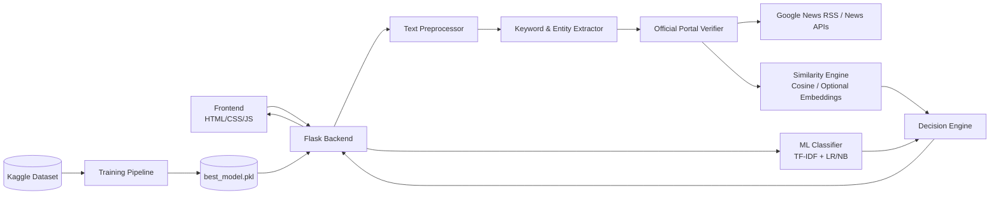

# Hybrid System Architecture

```mermaid
flowchart LR
    UI[Frontend\nHTML/CSS/JS] --> API[Flask Backend]
    API --> PRE[Text Preprocessor]
    PRE --> NER[Keyword & Entity Extractor]
    NER --> PV[Official Portal Verifier]
    PV --> RSS[Google News RSS / News APIs]
    PV --> SIM[Similarity Engine\nCosine / Optional Embeddings]
    API --> ML[ML Classifier\nTF-IDF + LR/NB]
    SIM --> DE[Decision Engine]
    ML --> DE
    DE --> API
    API --> UI

    DATA[(Kaggle Dataset)] --> TRAIN[Training Pipeline]
    TRAIN --> MODEL[(best_model.pkl)]
    MODEL --> API
```

